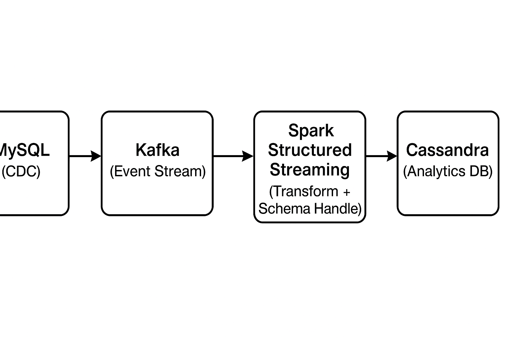

# 📡 Real-Time Streaming Pipeline – Timestamp-based CDC (On-Premises)  
**MySQL → Confluent Kafka → Databricks (Spark) → Astra DB (Cassandra)**

---

## 📌 Overview
This project demonstrates a **real-time streaming pipeline** running **on-premises**, where changes in **MySQL** are detected via a `last_updated` timestamp column, streamed into **Confluent Kafka**, processed in **Databricks (Spark Structured Streaming)**, and stored in **Astra DB** for real-time analytics.

Unlike typical CDC setups, this implementation **does not use Kafka Connect or Debezium** — instead, Spark queries MySQL incrementally and publishes the results to Kafka.

---

## 🚀 Architecture Flow
1. **MySQL** (on-prem)  
   - Source database  
   - CDC tracked using a `last_updated` timestamp column  

2. **Spark Structured Streaming (Databricks)**  
   - Reads new/updated rows from MySQL (where `last_updated > last_processed_time`)  
   - Publishes incremental data to **Kafka** topics  

3. **Confluent Kafka**  
   - Serves as a distributed event log  
   - Allows multiple consumers to process the same change events  

4. **Databricks** (streaming consumer)  
   - Reads data from Kafka topics  
   - Applies transformations & data enrichment  

5. **Astra DB**  
   - Cassandra-compatible database for storing analytics-ready data  
   - Supports real-time queries & dashboards  

---

## 🖼 Architecture Diagram


---

## ✨ Key Features
- **CDC without Kafka Connect** — pure timestamp-based incremental pull  
- **Near real-time latency** — data available in seconds  
- **Scalable event streaming** using Kafka  
- **Fault-tolerant processing** with Spark Structured Streaming  
- **Real-time query-ready data** in Astra DB  

---

## 🛠 Tech Stack
- **MySQL** – Relational DB (CDC source)  
- **Confluent Kafka** – Distributed event streaming platform  
- **Databricks (Spark)** – Data ingestion, transformation & streaming analytics  
- **Astra DB** – Cassandra-compatible analytics store  

---

## 📊 Use Cases
- Live business metrics dashboards  
- Real-time inventory tracking  
- Fraud detection with streaming alerts  

---

## ⚙️ How It Works

### 1️⃣ MySQL Setup for CDC
```sql
ALTER TABLE orders 
ADD COLUMN last_updated TIMESTAMP DEFAULT CURRENT_TIMESTAMP ON UPDATE CURRENT_TIMESTAMP;
